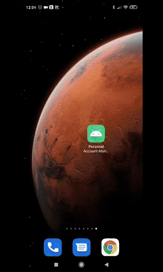
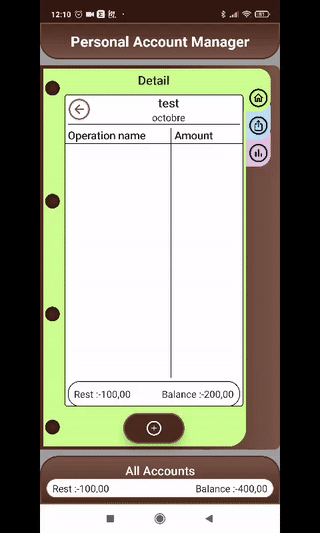
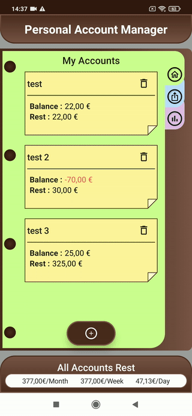
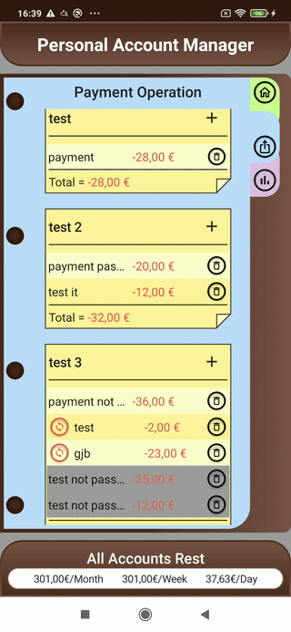
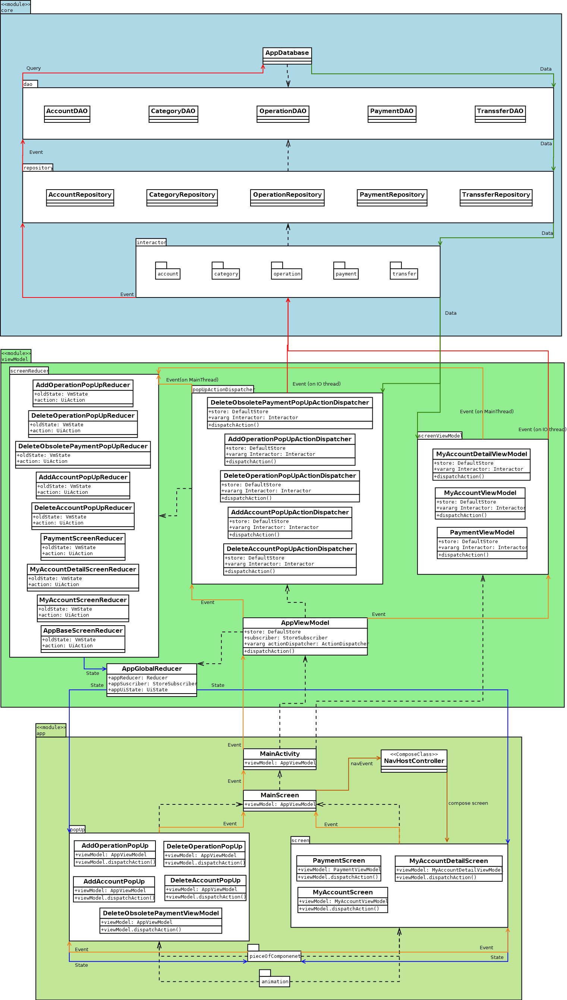

# Personal Account Manager

 ## 1. Requierements.

+ **Compile Sdk Version :** 31.
+ **Min Sdk Version :** 23.
+ **JavaVersion :** 1_8.
+ **KotlinVersion :** 1.5.31.
+ **ComposeVersion :** 1.0.3.
+ **HiltVersion :** 2.38.1.

## 2. Preview.
  

   ## Preview, principal fonctionalities :
  + Create and delete account.
  + create and delete operation/payment/transfer.
  + Obsolete payments deleted automatically.
  + Manually pass payment (single or all payments for account).
  ### todo :
  + Create categories and assign them to operations.
  + Chart for categories with filter.

### Manage accounts.

### Manage operations.

### Manage payments.

### Delete obsolete payment automatically.

## 3. Class Diagram.

  

## 4. Work done :

### Clean architecture.
+ Single activity.
+ Multi module.
+ DI with Hilt.
+ Coroutines/Job and Flow/StateFlow.

### Compose.
+ Entire Ui in jetpack compose.
+ Only one activity, no fragment and no business logic in application module.

### Other.
+ Implement reducer pattern.
+ Navigation with HiltViewModel and composable screen.
+ Unidirectional data flow
+ Single source of truth
+ SOLID/DRY/Single Responsibility/IOC.
